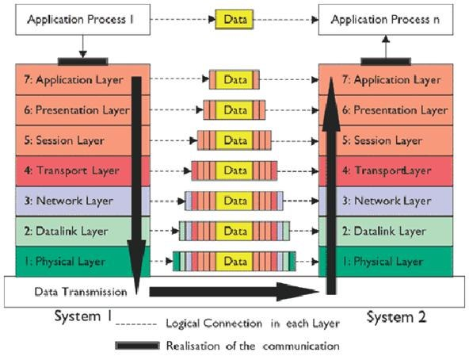

# TCP Client/Server

**Connection-oriented** 

* Two endpoints of a virtual circuit 

**Reliable** 

* Application needs no error checking 

**Stream-based** 

* No predefined blocksize 

**Processes identified by port numbers** 

**TCP Services live at specific ports**

