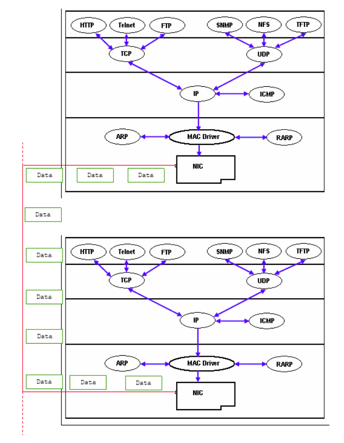

# Intro to TCP

The Transmission Control Protocol is connection oriented, provides error checking, and reliability of communication.

Most protocols commonly used on the internet use TCP including: HTTP, SMTP, and SSH.

TCP connections open with a handshake, data is transmitted, and then the connection is closed with a teardown.

TCP provides reliable transfer via:

* Correctly ordering packets received in arbitrary order.
* Validating received packets were not corrupt.
* Re-requesting packets that were corrupt or not received at all.
* Flow and congestion control.
* Requires positive acknowledgement before next data transmission.

**Source Port** – sending port

**Destination Port** – Receiving port

**Sequence Number** – Initially random. Each new transmission adds the size of the data

**Acknowledgment Number** – The next byte expected to be received.

**Data offset** - Size of TCP header in 32bit words

**Reserved** – 0's

**Flags** – Bit mask of all TCP flags

**Window size** – Max number of bytes receiver can handle

**Checksum** – Checksum of header and data

**Urgent Pointer** – Only valid if URG flag set

**Options** – Allows for expanded uses

